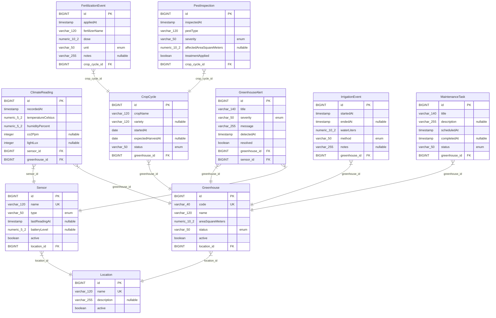

<!-- Auto-generated. Regenerate with: node tools/codegen/er-diagram.js -->

# Entity-Relationship Diagram

```mermaid
erDiagram
  ClimateReading {
    BIGINT id PK
    timestamp recordedAt
    numeric_5_2 temperatureCelsius
    numeric_5_2 humidityPercent
    integer co2Ppm "nullable"
    integer lightLux "nullable"
    BIGINT sensor_id FK
    BIGINT greenhouse_id FK
  }

  CropCycle {
    BIGINT id PK
    varchar_120 cropName
    varchar_120 variety "nullable"
    date startedAt
    date expectedHarvestAt "nullable"
    varchar_50 status "enum"
    BIGINT greenhouse_id FK
  }

  FertilizationEvent {
    BIGINT id PK
    timestamp appliedAt
    varchar_120 fertilizerName
    numeric_10_2 dose
    varchar_50 unit "enum"
    varchar_255 notes "nullable"
    BIGINT crop_cycle_id FK
  }

  Greenhouse {
    BIGINT id PK
    varchar_40 code UK
    varchar_120 name
    numeric_10_2 areaSquareMeters
    varchar_50 status "enum"
    boolean active
    BIGINT location_id FK
  }

  GreenhouseAlert {
    BIGINT id PK
    varchar_140 title
    varchar_50 severity "enum"
    varchar_255 message
    timestamp detectedAt
    boolean resolved
    BIGINT greenhouse_id FK
    BIGINT sensor_id FK
  }

  IrrigationEvent {
    BIGINT id PK
    timestamp startedAt
    timestamp endedAt "nullable"
    numeric_10_2 waterLiters
    varchar_50 method "enum"
    varchar_255 notes "nullable"
    BIGINT greenhouse_id FK
  }

  Location {
    BIGINT id PK
    varchar_120 name UK
    varchar_255 description "nullable"
    boolean active
  }

  MaintenanceTask {
    BIGINT id PK
    varchar_140 title
    varchar_255 description "nullable"
    timestamp scheduledAt
    timestamp completedAt "nullable"
    varchar_50 status "enum"
    BIGINT greenhouse_id FK
  }

  PestInspection {
    BIGINT id PK
    timestamp inspectedAt
    varchar_120 pestType
    varchar_50 severity "enum"
    numeric_10_2 affectedAreaSquareMeters "nullable"
    boolean treatmentApplied
    BIGINT crop_cycle_id FK
  }

  Sensor {
    BIGINT id PK
    varchar_120 name UK
    varchar_50 type "enum"
    timestamp lastReadingAt "nullable"
    numeric_5_2 batteryLevel "nullable"
    boolean active
    BIGINT location_id FK
  }

  ClimateReading }|--|| Sensor : "sensor_id"
  ClimateReading }|--|| Greenhouse : "greenhouse_id"
  CropCycle }|--|| Greenhouse : "greenhouse_id"
  FertilizationEvent }|--|| CropCycle : "crop_cycle_id"
  Greenhouse }|--|| Location : "location_id"
  GreenhouseAlert }|--|| Greenhouse : "greenhouse_id"
  GreenhouseAlert }|--|| Sensor : "sensor_id"
  IrrigationEvent }|--|| Greenhouse : "greenhouse_id"
  MaintenanceTask }|--|| Greenhouse : "greenhouse_id"
  PestInspection }|--|| CropCycle : "crop_cycle_id"
  Sensor }|--|| Location : "location_id"
```
